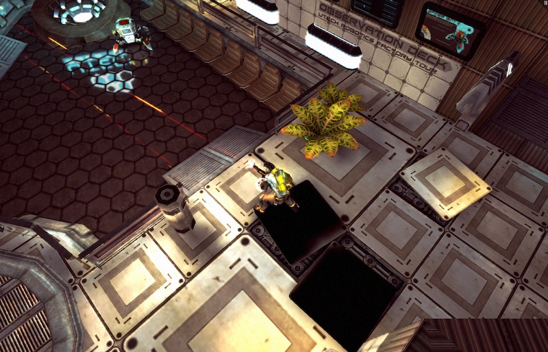
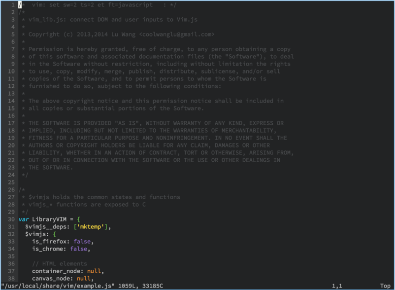

<!-- $size: 16:9 -->

# Rust and WebAssembly

Joshua Warner - Rust Denver/Boulder meetup - 2016-09-21

---

# What is WebAssembly

(and why should I care)

---

WebAssembly or wasm is a new portable, size- and load-time-efficient format suitable for compilation to the web.

\- webassembly.github.io

---

# What it's not

* A replacement for JavaScript
* A way to run JavaScript
* An assembly language
* Access to web APIs from native code
* Specific to the Web

---

# What is it, really?

* A way to run portable native code in the browser
* A pre-1.0 W3C spec
* A compile target for C/C++, many more languages to come
* A binary format for the web (!)

---

# A taste

```hexdump
00000000  00 61 73 6d 0c 00 00 00  04 74 79 70 65 89 80 80  |.asm.....type...|
00000010  80 00 02 40 02 01 01 00  40 00 00 06 69 6d 70 6f  |...@....@...impo|
00000020  72 74 8c 80 80 80 00 01  00 00 03 65 6e 76 04 70  |rt.........env.p|
00000030  75 74 73 08 66 75 6e 63  74 69 6f 6e 82 80 80 80  |uts.function....|
00000040  00 01 01 06 6d 65 6d 6f  72 79 82 80 80 80 00 01  |....memory......|
00000050  01 06 65 78 70 6f 72 74  88 80 80 80 00 01 00 00  |..export........|
00000060  04 6d 61 69 6e 04 63 6f  64 65 91 80 80 80 00 01  |.main.code......|
00000070  8b 80 80 80 00 00 10 04  10 00 2a 02 00 18 02 00  |..........*.....|
00000080  04 64 61 74 61 8e 80 80  80 00 01 10 00 0f 09 05  |.data...........|
00000090  00 00 00 48 65 6c 6c 6f  04 6e 61 6d 65 87 80 80  |...Hello.name...|
000000a0  80 00 01 04 6d 61 69 6e  00                       |....main.|
```

---

# Disassembled

```
(module
  (memory 1 1 (segment 0 "\05\00\00\00Hello"))
  (import $puts "env" "puts" (param i32 i32))
  (func $main
    (call_import $puts (i32.const 4) (i32.load (i32.const 0)))
  )

  (export "main" $main)
)

```

NOTE: the text format is not yet finalized

---

# I bet you can't guess what that does...

---

```
# Note: this is an approximation
$ ./wasm hello.wasm
Hello
```

---

```
(module
	; ...
)
```

As WebAssembly _module_ is very similar to a rust _crate_

---

```
(memory 1 1 (segment 0 "\05\00\00\00Hello"))
```

1 page (64k) of initial memory
1 page maximum
Initialize the 9 bytes starting at 0 with the (hex-escaped) string "\05\00\00\00Hello"

---

## Memory is contiguous
## It starts at 0 -> null is actually a valid address!
## It's always bounds checked

---

```
(import $puts "env" "puts" (param i32 i32))
```

Import `"puts"` from module `"env"`, and call it `$puts` locally.

---

```
(func $main
  ; ...
)
```

Declare a function with ID `$main` with no parameters and no return value

---

```
(i32.load (i32.const 0))
```

Load a 32-bit int from address `0`

---

```
(call_import $puts (i32.const 4) (i32.load (i32.const 0)))
```

Call the import with local ID `$puts`, passing `0` and the result of the load as arguments

---

```
(export "main" $main)
```

Export the function with ID `$main` as `"main"`

---

From JavaScript:

```javascript
const module = Wasm.instantiateModule(helloOldWasmBuffer, {
  env: {
    puts: (offset, len) => {
      const d = new TextDecoder("utf-8");
      output.innerText +=
        d.decode(m.exports.memory.slice(offset, offset + len)) + "\n";
    }
  }
});

module.exports.main();
```

---

# But it's pre-release, right?

---

# Really large applications: [Demo](https://webassembly.github.io/demo/).

---

# Rust on WebAssembly

---

# Can I compile Rust to WebAssembly?

---

# Soon!

* https://internals.rust-lang.org/t/need-help-with-emscripten-port/3154/111
* https://github.com/rust-lang/rust/pull/36339
* https://github.com/rust-lang/rust/issues/33205

---

# mir2wasm

* Smaller, lighter weight.
* Kind-of working _now_
* https://github.com/brson/mir2wasm

---

# Applications

---

# Web games


[Angry Bots](https://webassembly.github.io)

---

# Deploying large apps to the web


[vim.js](http://coolwanglu.github.io/vim.js/emterpreter/vim.html)

---

# But what if it didn't have to run on the web?

---

# Bootstrapping `rustc`

---

```
$ rustc --print target-list | pr -3 -tw100
aarch64-apple-ios      		 i686-linux-android    		  x86_64-apple-darwin
aarch64-linux-android  		 i686-pc-windows-gnu   		  x86_64-apple-ios
aarch64-unknown-linux-gnu      	 i686-pc-windows-msvc  		  x86_64-pc-windows-gnu
arm-linux-androideabi  		 i686-unknown-dragonfly		  x86_64-pc-windows-msvc
arm-unknown-linux-gnueabi      	 i686-unknown-freebsd  		  x86_64-rumprun-netbsd
arm-unknown-linux-gnueabihf    	 i686-unknown-linux-gnu		  x86_64-sun-solaris
armv7-apple-ios			 i686-unknown-linux-musl       	  x86_64-unknown-bitrig
armv7-linux-androideabi		 le32-unknown-nacl     		  x86_64-unknown-dragonfly
armv7-unknown-linux-gnueabihf  	 mips-unknown-linux-gnu		  x86_64-unknown-freebsd
armv7s-apple-ios       		 mips-unknown-linux-musl       	  x86_64-unknown-linux-gnu
asmjs-unknown-emscripten       	 mipsel-unknown-linux-gnu      	  x86_64-unknown-linux-musl
i386-apple-ios 			 mipsel-unknown-linux-musl     	  x86_64-unknown-netbsd
i586-pc-windows-msvc   		 powerpc-unknown-linux-gnu     	  x86_64-unknown-openbsd
i586-unknown-linux-gnu 		 powerpc64-unknown-linux-gnu
i686-apple-darwin      		 powerpc64le-unknown-linux-gnu
```

---

# Compiling bitcoin 

---

Confession:
# I wrote a WebAssembly interpreter
## Here's what I learned.

---

# Zero-copy parsing

Works really well in rust:

```
struct Module<'a> {
  imports: Vec<Import<'a>>,
  // ...
}

struct Import<'a> {
  module_name: &'a str,
  function_name: &'a str,
  function_type: TypeIndex,
}
```

---

# Writable zero-copy structures?

---

Writable zero-copy

# Possible solution: arenas

```rust
struct Module<'a> { items: Vec<&'a [u8]> }

let ar = Arena::new(1024);
let m = Module::new();
let bytes = ar.alloc_mut(5);
bytes.copy_from_slice(b"Hello");
m.items.push(bytes);
```

---

```rust
// NOTE: there's a similar struct/pattern in _unstable_ std
impl Arena {
  fn alloc_mut(&self, size: usize) -> &mut [u8] {
    // self CAN'T BE MUTABLE in the signature.  Awkward.

    /* ... */
  }
}
```

---

Writable zero-copy

# My solution: generify ownership

```rust
struct Module<B: AsBytes> { items: Vec<B> }

fn parse<'a>(data: &'a [u8]) -> Module<&'a [u8]> { /* ... */ }

fn write<B: AsBytes, W: Write>(module: &Module<B>, writer: W) { /* ... */ }

```

---

# Wrapping integers

Painful if you don't do it rust's way

```
fn u64_from_real_i32(val: i32) -> Wrapping<u64> {
  u64_from_i64(Wrapping(val as i64))
}

fn u64_from_i64(val: Wrapping<i64>) -> Wrapping<u64> {
  unsafe { mem::transmute(val) }
}
```

---

# NaN handling

Again: painful

```
if ao.is_nan() {
  ao
} else if bo.is_nan() {
  bo
} else {
  ao.min(bo)
}
```

---

# NaN handling

Had to check the sign bit by hand:

```
fn copysign_f64(a: f64, b: f64) -> f64 {
  if (unsafe { mem::transmute::<f64, u64>(b) } & 0x8000_0000_0000_0000u64) == 0 {
    a.abs()
  } else {
    -a.abs()
  }
}
```

---

# Questions?

---

Extra: It'd be cool if...

# Pre-commit checks actually worked in practice?

(Enter WebAssembly)

---

Extra

# Hexfloat

```
nan +nan -nan
nan:0x012345 +nan:0x304050 -nan:0x2abcde
infinity +infinity -infinity 0x0.0p0 +0x0.0p0 -0x0.0p0
0x1.921fb6p+2 0x1p-149 0x1p-126 0x1.fffffep+127 0x1.fffffcp-127
0x1.p10 0.0e0 +0.0e0 -0.0e0
6.28318548202514648
1.4013e-45 1.1754944e-38 1.1754942e-38 3.4028234e+38 1.e10
```


---

# The End.  For real this time.

---

# Just trolling.
